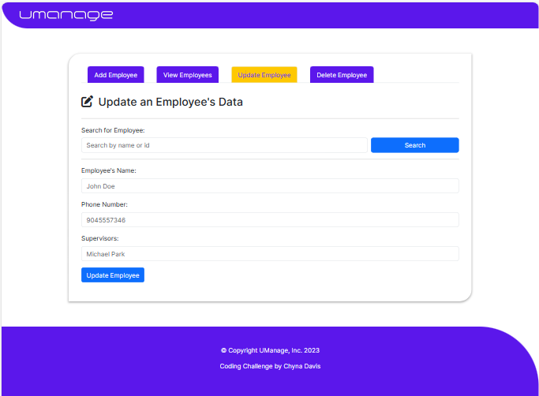
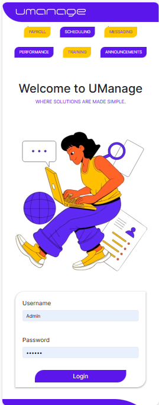

# UManage - Employee Data Management System

A full-stack web application for efficient employee data management using CRUD operations.

## Technologies Used

**Frontend**
- Angular
- TypeScript
- CSS
- Bootstrap

**Backend**
- Java
- Spring Boot
- Spring Security
- MySQL

## Challenges Faced

- Learning Angular and TypeScript for the first time.
- Initial difficulties in understanding the project structure and Angular concepts.
- CORS configuration issues and handling API keys.

## Future Work

- Resolve CORS configuration issues for smoother API communication.
- Implement frontend user authentication.
- Enhance the user interface and add more features for a complete employee management system.

## Screenshots

